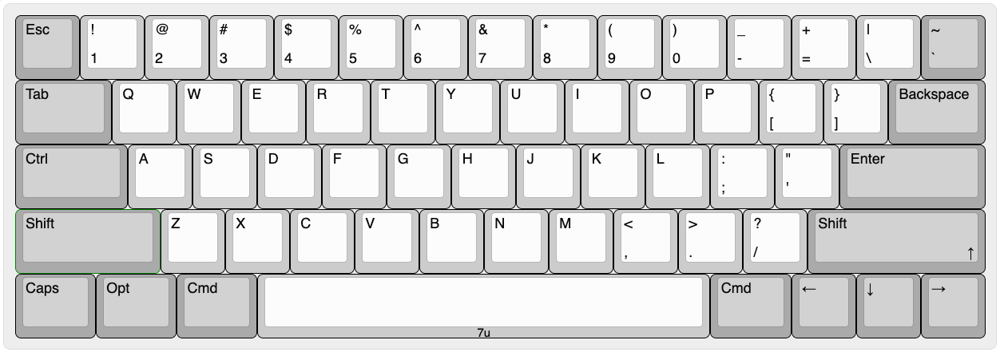

# Gensym60

A redesign of the symmetrical 60% keyboard.



- 60% layout
- 7u space bar
- Split backspace
- Arrow keys (Up is mod-tap on the right shift)
- No split right shift


## Build firmware

```shell
git clone https://github.com/susumuota/gensym60.git

git clone https://github.com/vial-kb/vial-qmk.git
cd vial-qmk

# copy gensym60 directory to vial-qmk
rsync -av --delete ../gensym60/vial-qmk/keyboards/infinitemonkey/gensym60/ keyboards/infinitemonkey/gensym60/

RUNTIME="docker" SKIP_FLASHING_SUPPORT=1 util/docker_cmd.sh make infinitemonkey/gensym60:vial

ls -l infinitemonkey_gensym60_vial.bin
# -rwxr-xr-x 1 user group 37072 Jun 18 01:23 infinitemonkey_gensym60_vial.bin
```

## Flash firmware

Install `dfu-util` package.

```shell
brew install dfu-util
```

```shell
# unplug and plug the device pressing the dfu button
dfu-util -l
sudo dfu-util -a 0 -s 0x08000000:unprotect:force

# unplug and plug the device pressing the dfu button
dfu-util -l
sudo dfu-util -a 0 -s 0x08000000:mass-erase:force

# unplug and plug the device pressing the dfu button
dfu-util -l
sudo dfu-util -a 0 -s 0x08000000:leave -D infinitemonkey_gensym60_vial.bin
```

## References

- https://github.com/Unified-Daughterboard/UDB-C-JSH
- https://github.com/kkatano/bakeneko-60
- https://github.com/takishim/mikeneko65
- https://github.com/tominabox1/Le-Chiffre-Keyboard
- https://github.com/sporkus/le_chiffre_keyboard_stm32
- https://github.com/joe-scotto/scottokeebs/tree/main/Extras/ScottoModules/STM32F072CBT6
- https://www.st.com/resource/en/application_note/an4080-getting-started-with-stm32f0x1x2x8-hardware-development-stmicroelectronics.pdf
- https://www.st.com/en/evaluation-tools/32f072bdiscovery.html
- https://microfan.shop/products/stm32f072-mini-r1
- https://github.com/ShaneTWilliams/stm32-dev-board
- https://github.com/bennymeg/Fabrication-Toolkit
- https://github.com/Salicylic-acid3/KiCAD_FootPrint

